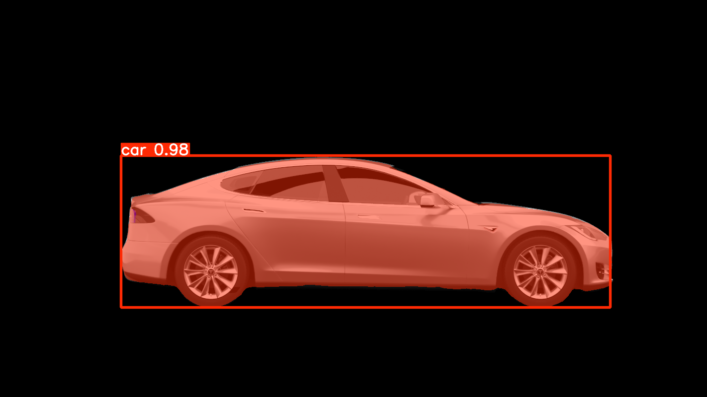

# SAM3-AutoAnnotator

A Python CLI tool for **SAM3 text-prompted auto-annotation** using the **Ultralytics SAM3 pipeline**.

SAM3-AutoAnnotator runs SAM3 segmentation on a single image or an image folder, then exports structured annotation outputs for inspection, debugging, and optional YOLO training workflows.

> This project does not implement SAM3 from scratch. It builds a practical auto-annotation workflow around Ultralytics SAM3 inference.

---

## Overview

SAM3-AutoAnnotator is designed for users who want to turn SAM3 prediction results into reusable annotation outputs.

It can generate:

- CSV files for detailed inspection and debugging
- YOLO TXT labels for training workflows
- Prediction visualization images for quick quality checking
- A run summary file for tracking each annotation job

Each run is saved into a separate project folder to keep outputs organized and prevent accidental overwrites.

---

## What is SAM3?

SAM3, or Segment Anything Model 3, is a foundation model for promptable visual segmentation developed by Meta.

Unlike traditional segmentation models that are usually trained for a fixed set of classes, SAM3 is designed to segment objects based on user-provided prompts. In this project, SAM3 is used with text prompts such as `car`, `person`, or `"sports car"` to identify and segment matching objects in images.

SAM3 can produce segmentation masks and bounding boxes from prompts. Those prediction outputs can then be converted into reusable annotation formats.

In SAM3-AutoAnnotator, SAM3 is used as the vision foundation model, while this project handles the surrounding annotation workflow:

- loading one image or a folder of images
- running SAM3 text-prompted prediction through the Ultralytics pipeline
- saving prediction visualization images
- exporting detailed CSV files for inspection
- exporting optional YOLO TXT labels for training workflows
- organizing outputs into project folders

This project does not train, fine-tune, or reimplement SAM3. It uses SAM3 predictions and converts them into practical annotation outputs.

```text
SAM3 = foundation segmentation model
SAM3-AutoAnnotator = CLI workflow tool for organizing and exporting SAM3 prediction outputs
```

---

## Example Prediction

Below is an example SAM3 prediction visualization generated by SAM3-AutoAnnotator.



---

## Watch Demo

Watch the demo video here:

[Watch Demo on YouTube](https://www.youtube.com/watch?v=2rhbMr5g6Lg)

---

## Key Features

- SAM3 text-prompted segmentation
- Single-image and folder input support
- Project-based output folders
- CSV export for detailed prediction inspection
- Optional YOLO TXT export for training workflows
- YOLO segmentation label export
- YOLO detection label export
- Prediction visualization images saved by default
- Per-image and total class counting
- Confidence score logging
- Run summary generation
- Timestamp-based overwrite protection
- Windows-friendly path handling

---

## Quick Start

Install dependencies:

```powershell
pip install -r requirements.txt
```

Run SAM3 auto-annotation with the default CSV export:

```powershell
python sam3_auto_annotator.py --input "path\to\images" --model "path\to\sam3.pt" --text car --project-name car_annotation
```

Export both CSV files and YOLO TXT labels:

```powershell
python sam3_auto_annotator.py --input "path\to\images" --model "path\to\sam3.pt" --text car --project-name car_annotation --export-formats csv yolo
```

Run on a single image:

```powershell
python sam3_auto_annotator.py --input "path\to\image.jpg" --model "path\to\sam3.pt" --text car
```

---

## SAM3 Access

This repository does **not** include SAM3 model weights.

SAM3 model weights/checkpoints are not bundled with this project and should not be committed to this repository. To use SAM3, you must request access to the official SAM3 model weights first.

After access is approved, download the SAM3 weight file, such as `sam3.pt`, and pass its local path with `--model`.

```powershell
python sam3_auto_annotator.py --input "path\to\images" --model "path\to\sam3.pt" --text car
```

You can check the Ultralytics SAM3 documentation for setup details, including how SAM3 weights are handled when using the Ultralytics pipeline. Ultralytics notes that SAM3 weights are not automatically downloaded, so the user must request access, download `sam3.pt`, and provide the local model path manually.

In short:

```text
1. Request access to SAM3 weights/checkpoints.
2. Download the SAM3 model file after approval.
3. Keep the model file outside this GitHub repository.
4. Pass the local model path with --model.
```

---

## Backend

SAM3-AutoAnnotator uses the Ultralytics SAM3 pipeline as its inference backend, so users can run SAM3 prediction through the same interface used by the Ultralytics SAM integration.

Internally, the script uses:

```python
from ultralytics.models.sam import SAM3SemanticPredictor
```

The tool forwards the model path, confidence threshold, and text prompts to Ultralytics `SAM3SemanticPredictor`.

This project focuses on the workflow around SAM3 inference:

- input image collection
- SAM3 prediction execution
- mask and bounding box extraction
- CSV export
- optional YOLO TXT export
- prediction visualization saving
- project-based output management

---

## Supported Inputs

Use `--input` with either:

- a single image file
- a folder containing image files

Supported image formats:

```text
.jpg
.jpeg
.png
.bmp
.tif
.tiff
.webp
```

Folder input is currently **non-recursive**. Images inside subfolders are not processed.

---

## Export Formats

SAM3-AutoAnnotator supports two export formats:

| Format | Purpose |
|---|---|
| `csv` | Detailed inspection and debugging of SAM3 predictions |
| `yolo` | YOLO TXT labels for training workflows |

CSV export is the default.

```powershell
--export-formats csv
```

Use both CSV and YOLO TXT export:

```powershell
--export-formats csv yolo
```

Use YOLO TXT export only:

```powershell
--export-formats yolo
```

YOLO TXT labels are generated from SAM3 prediction outputs and should be reviewed before training.

---

## Output Structure

### CSV only

```text
outputs/
└── car_annotation/
    ├── sam3_auto_annotation_xyn_outputs.csv
    ├── sam3_auto_annotation_box_outputs.csv
    ├── run_summary.json
    └── prediction_results/
        ├── image_001_predicted.png
        └── image_002_predicted.png
```

### YOLO only

```text
outputs/
└── car_annotation/
    ├── run_summary.json
    ├── prediction_results/
    │   └── image_001_predicted.png
    └── yolo_labels/
        ├── segmentation/
        │   └── image_001.txt
        └── detection/
            └── image_001.txt
```

### CSV + YOLO

```text
outputs/
└── car_annotation/
    ├── sam3_auto_annotation_xyn_outputs.csv
    ├── sam3_auto_annotation_box_outputs.csv
    ├── run_summary.json
    ├── prediction_results/
    │   └── image_001_predicted.png
    └── yolo_labels/
        ├── segmentation/
        │   └── image_001.txt
        └── detection/
            └── image_001.txt
```

---

## Usage Examples

### Folder input

```powershell
python sam3_auto_annotator.py --input "path\to\images" --model "path\to\sam3.pt" --text car --project-name car_run
```

### Single image input

```powershell
python sam3_auto_annotator.py --input "path\to\image.jpg" --model "path\to\sam3.pt" --text car
```

### Multiple text prompts

```powershell
python sam3_auto_annotator.py --input "path\to\images" --model "path\to\sam3.pt" --text person car dog
```

Multi-word prompts should be quoted:

```powershell
python sam3_auto_annotator.py --input "path\to\images" --model "path\to\sam3.pt" --text "sports car" "traffic light"
```

### Export CSV only

```powershell
python sam3_auto_annotator.py --input "path\to\images" --model "path\to\sam3.pt" --text car --export-formats csv
```

### Export CSV and YOLO TXT labels

```powershell
python sam3_auto_annotator.py --input "path\to\images" --model "path\to\sam3.pt" --text car --export-formats csv yolo
```

### Export YOLO TXT labels only

```powershell
python sam3_auto_annotator.py --input "path\to\images" --model "path\to\sam3.pt" --text car --export-formats yolo
```

### Export YOLO labels only without prediction images

```powershell
python sam3_auto_annotator.py --input "path\to\images" --model "path\to\sam3.pt" --text car --export-formats yolo --no-save-predictions
```

### Always append a timestamp

```powershell
python sam3_auto_annotator.py --input "path\to\images" --model "path\to\sam3.pt" --text car --project-name car_run --timestamp
```

### Use a custom output root

```powershell
python sam3_auto_annotator.py --input "path\to\images" --model "path\to\sam3.pt" --text car --output-root "annotation_outputs" --project-name car_run
```

### Disable prediction visualization images

Prediction visualization images are saved by default.

Disable them with:

```powershell
python sam3_auto_annotator.py --input "path\to\images" --model "path\to\sam3.pt" --text car --no-save-predictions
```

---

## Project Output Behavior

Outputs are written under `outputs/` by default.

- `--project-name` sets the project folder name.
- Without `--project-name`, the script derives a name from the input and prompts.
- If the project folder already exists, a timestamp suffix is added automatically.
- `--timestamp` always appends a timestamp.
- `--overwrite` allows writing into an existing project folder.
- `--output-root` changes the root output directory.

This prevents annotation results from different runs from being mixed together.

---

## Prediction Results

Prediction visualization images are saved by default in:

```text
prediction_results/
```

Each saved image uses the original image stem plus `_predicted.png`.

Example:

```text
2-Tesla-Model-S_predicted.png
```

These images are for visual inspection only. They help users quickly check whether SAM3 predictions look reasonable before using the exported annotation data.

Disable prediction image output with:

```powershell
--no-save-predictions
```

`--save-annotated` is kept as a legacy alias for `--save-predictions`.

---

## CSV Outputs

When CSV export is enabled, each project folder contains:

```text
sam3_auto_annotation_xyn_outputs.csv
sam3_auto_annotation_box_outputs.csv
```

### Polygon CSV

`sam3_auto_annotation_xyn_outputs.csv` stores normalized polygon segmentation data extracted from SAM3 mask outputs.

It includes:

- image path
- image name
- image index
- object index
- class ID
- class name
- per-image class count
- total class count
- polygon point count
- normalized polygon coordinates
- YOLO-style segmentation line
- confidence score

### Bounding Box CSV

`sam3_auto_annotation_box_outputs.csv` stores bounding box data extracted from SAM3 box outputs.

It includes:

- image path
- image name
- image index
- object index
- class ID
- class name
- per-image class count
- total class count
- absolute `xyxy` box coordinates
- box width and height
- box center coordinates
- normalized YOLO box values
- confidence score

---

## YOLO TXT Outputs

When YOLO export is enabled, each project folder contains:

```text
yolo_labels/
├── segmentation/
│   └── image_001.txt
└── detection/
    └── image_001.txt
```

The TXT filename uses the original image stem.

Example:

```text
2-Tesla-Model-S.jpg
```

writes labels to:

```text
2-Tesla-Model-S.txt
```

### YOLO segmentation format

Segmentation labels use normalized polygon coordinates from `result.masks.xyn`.

```text
class_id x1 y1 x2 y2 x3 y3 ...
```

### YOLO detection format

Detection labels use normalized boxes from `result.boxes.xywhn` when available, or normalized values computed from `result.boxes.xyxy` and the image size.

```text
class_id x_center_norm y_center_norm width_norm height_norm
```

If an image has no detections, empty segmentation and detection `.txt` files are still created for that image.

YOLO TXT export does not copy images into the label folders and does not generate `data.yaml` yet.

---

## Run Summary

By default, the script writes:

```text
run_summary.json
```

It includes:

- project name
- output folder
- selected export formats
- input path
- model path
- text prompts
- confidence threshold
- images processed
- images with detections
- images with no detections
- total detections
- class counts
- generated output file paths
- prediction results folder path
- YOLO label folder paths
- creation timestamp

Disable it with:

```powershell
--no-run-summary
```

---

## CLI Options

| Option | Required | Description |
|---|---:|---|
| `--input` | Yes | Path to one image file or a folder of images |
| `--model` | Yes | Path to the local SAM3 model weight file, such as `sam3.pt` |
| `--text` | Yes | One or more text prompts/classes |
| `--conf` | No | Confidence threshold. Default: `0.7` |
| `--half` / `--no-half` | No | Enable or disable fp16 inference. Default: enabled |
| `--project-name` | No | Name of the output project folder |
| `--output-root` | No | Root folder for output projects. Default: `outputs` |
| `--export-formats` | No | One or more output formats: `csv`, `yolo`. Default: `csv` |
| `--timestamp` | No | Always append a timestamp to the output folder name |
| `--overwrite` | No | Allow writing into an existing project output folder |
| `--save-predictions` / `--no-save-predictions` | No | Enable or disable prediction visualization images in `prediction_results/`. Default: enabled |
| `--save-annotated` | No | Legacy alias for `--save-predictions` |
| `--run-summary` / `--no-run-summary` | No | Enable or disable `run_summary.json`. Default: enabled |
| `--show` | No | Display prediction visualization images with matplotlib |

---

## Requirements

Install dependencies with:

```powershell
pip install -r requirements.txt
```

SAM3 support depends on the Ultralytics version installed in your environment. Make sure your Ultralytics installation supports SAM3.

---

## Notes and Limitations

- This repository does not include SAM3 model weights.
- Users must request access to SAM3 weights/checkpoints separately.
- Users must provide the local SAM3 model path with `--model`.
- Folder input is currently non-recursive.
- Prediction visualization images are for visual inspection only.
- Auto annotations should be reviewed before being used as final training labels.
- YOLO TXT labels are generated from SAM3 prediction outputs and should be reviewed before training.
- Images are not copied into YOLO label folders.
- `data.yaml` and train/val/test split logic are not generated yet.
- Output quality depends on the SAM3 model, prompt quality, image quality, and confidence threshold.
- The confidence threshold is forwarded to Ultralytics SAM3 inference through `--conf`.
- FP16 behavior depends on the device and backend. Use `--no-half` if FP16 is not supported in your environment.

---

## License and Attribution

This project is an auto-annotation utility built around Ultralytics SAM3 inference.

SAM3 is developed by Meta. This repository does not include SAM3 model weights. Users are responsible for requesting access to SAM3 weights/checkpoints and complying with the SAM license terms.

Ultralytics is used as the SAM3 inference pipeline through `SAM3SemanticPredictor`.

If you use SAM3 outputs in research or publication, acknowledge the use of SAM Materials according to the SAM license.

---

## Portfolio Summary

SAM3-AutoAnnotator demonstrates a practical computer vision annotation workflow using Python, Ultralytics SAM3, text-prompted segmentation, CSV export, optional YOLO TXT export, prediction visualization saving, and project-based output organization.

The project focuses on building a reusable tool around an existing foundation model rather than training a segmentation model from scratch.