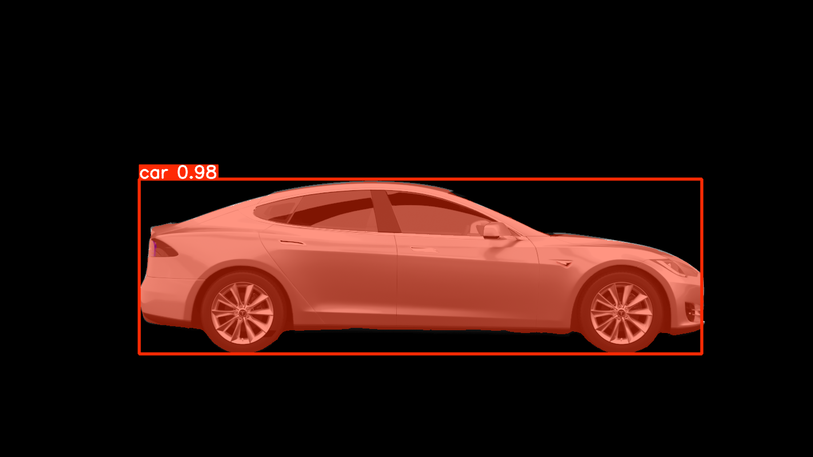

# SAM3-AutoAnnotator

A clean Python CLI tool for **SAM3 text-prompted auto-annotation** using Ultralytics `SAM3SemanticPredictor`.

SAM3-AutoAnnotator runs SAM3 on a single image or a folder of images, then exports practical annotation files for review, debugging, and downstream dataset preparation.

## Overview

This project is designed to turn SAM3 inference into a reusable annotation workflow.

It does not train SAM3 and does not reimplement SAM3. Instead, it wraps Ultralytics SAM3 inference into a structured CLI pipeline that can generate:

- polygon CSV annotations
- bounding-box CSV annotations
- YOLO segmentation labels
- YOLO detection labels
- prediction visualization images
- run summary JSON files

The main goal is to make SAM3 outputs easier to inspect, export, and reuse in computer vision dataset workflows.

## Features

- Text-prompted SAM3 auto-annotation
- PySide6 desktop GUI for human-in-the-loop bounding-box annotation
- Editable SAM3 draft boxes
- Manual bounding-box draw, move, resize, delete, and class correction
- Folder batch pre-annotation with `Run SAM3 All Remaining`
- Existing YOLO detection label import
- Corrected YOLO detection and bounding-box CSV export from edited state
- Resumable GUI projects with `annotation_state.json`
- Single-image input support
- Non-recursive folder input support
- Multiple text prompts as class names
- Stable prompt-order to class-ID mapping
- CSV export for normalized mask polygons
- CSV export for bounding boxes
- YOLO segmentation TXT export
- YOLO detection TXT export
- Prediction visualization images saved by default
- Per-image and total class counting
- Confidence score logging
- Optional YAML config file
- Direct CLI arguments can override config values
- Project-based output folders under `outputs/`
- Packaged CLI command: `sam3-auto-annotator`

## Example Prediction

Below is an example SAM3 prediction visualization generated by SAM3-AutoAnnotator.



## Project Structure

```text
SAM3-AutoAnnotator/
├── assets/
│   └── sample_prediction.png
├── configs/
│   └── default.yaml
├── data/
├── models/
├── outputs/
├── scripts/
│   └── run_auto_annotator.py
├── src/
│   └── sam3_auto_annotator/
│       ├── __init__.py
│       ├── __main__.py
│       ├── cli.py
│       ├── config.py
│       ├── paths.py
│       ├── predictor.py
│       ├── pipeline.py
│       ├── summary.py
│       ├── visualization.py
│       └── exporters/
│           ├── __init__.py
│           ├── csv_exporter.py
│           └── yolo_exporter.py
├── run_sam3_auto_annotator.py
├── pyproject.toml
├── requirements.txt
├── .gitignore
└── README.md
```

## Installation

Clone the repository and install it in editable mode.

```powershell
pip install -e .
```

Verify the installed CLI command.

```powershell
sam3-auto-annotator --help
```

## GUI Annotation App

SAM3-AutoAnnotator includes a PySide6 desktop GUI for human-in-the-loop
bounding-box annotation. SAM3 predictions are treated as editable draft boxes:
you can run SAM3, review the results, resize or delete incorrect boxes, add
manual boxes, import existing YOLO labels, save the project state, and export
corrected labels.


The GUI workspace is organized around a left Dataset browser, central annotation
canvas, and right Setup / Annotation / Results inspector. Common workflows are
available from the compact command bar: Run SAM3 on the current image, Run All
Remaining for folder pre-annotation, Import YOLO labels, review/edit boxes, and
Export corrected labels.

### GUI Installation

Install the optional GUI dependencies:

```powershell
pip install -e .[gui]
```

Launch from the repository root:

```powershell
python sam3auto_app.py
```

Or, after editable install:

```powershell
sam3-auto-annotator-gui
```

The CLI remains available after installing the GUI extra.

```powershell
sam3-auto-annotator --help
```

### GUI Feature Summary

- Human-in-the-loop annotation workflow
- Single-image and non-recursive folder projects
- Editable SAM3 draft boxes
- SAM3 mask/polygon preview for unchanged draft annotations
- Manual bounding-box draw, select, move, resize, delete, and class correction
- Current-image SAM3 inference with predictor cache/reuse
- Folder pre-annotation with `Run SAM3 All Remaining`
- Existing YOLO detection label import
- Corrected YOLO detection label export
- Corrected bounding-box CSV export
- Preview image export for reviewed annotations
- Resumable project state via `annotation_state.json`

### Basic GUI Workflow

1. Launch the GUI.

   ```powershell
   python sam3auto_app.py
   ```

2. Open one image or a folder from the top command bar.
3. Confirm or edit the output folder in the Setup tab.
4. Add classes/prompts, one per line or comma-separated.
5. Draw boxes manually or run SAM3 to create draft boxes.
6. Review each image and correct boxes by dragging, resizing handles, editing
   coordinates, deleting boxes, or changing class.
7. Save the project state.
8. Export corrected labels.

### Recommended Workflow

For real dataset work, use this sequence:

```text
Open Folder -> Import YOLO or Run SAM3 All -> Review/Edit -> Save -> Export
```

This keeps imported or SAM3-generated annotations as drafts and makes the
editable GUI state the source of truth for final export.

### SAM3-Assisted Workflow

1. Open an image or folder.
2. Select the local SAM3 model file.
3. Enter class prompts in the Setup tab.
4. Set confidence and fp16 precision as needed.
5. Click `Run SAM3` for the selected image.
6. Correct boxes in the canvas or Annotation tab.

The GUI caches the loaded predictor for repeated runs with the same model,
confidence, and fp16 settings. If those settings change, the predictor is
reloaded.

SAM3 predictions may include both bounding boxes and segmentation masks/polygons.
In the GUI, masks and polygons are preview-only: editing a SAM3 bbox or class
makes that mask stale, hides it from the canvas, and excludes it from
segmentation export. Use `Reset to SAM3` on a selected annotation to restore the
original SAM3 bbox/class and make its mask/polygon preview and segmentation
export valid again.

### Batch Pre-Annotation Workflow

Use `Run All Remaining` to run SAM3 over a folder/project without blocking the
GUI.

The default batch policy is conservative:

- Runs only images with status `not_predicted` or `error`.
- Skips `predicted`, `edited`, `reviewed`, and `no_detection` images.
- Does not silently overwrite user-edited or reviewed annotations.
- Continues past per-image failures and marks failed images as `error`.
- Cancel stops after the current image finishes; partial results remain in the
  project state.

After a batch run, save `annotation_state.json` before closing the app.

### Import Existing YOLO Labels

Use `Import YOLO` from the command bar or `Import YOLO Labels` in the Setup tab.

The importer expects YOLO detection labels:

```text
class_id x_center y_center width height
```

Rules:

- Label files are matched to images by stem.
- For example, `image_001.jpg` matches `image_001.txt`.
- Coordinates are normalized YOLO `xywh` values and are converted to original
  image-pixel `xyxy` boxes.
- Imported boxes become editable annotations.
- If an imported box is edited, its source becomes `edited`.
- Missing label file leaves the image as `not_predicted`.
- Empty label file marks the image as `no_detection`.
- Edited and reviewed images are skipped by default.
- Invalid label lines are skipped and counted in the import summary.
- Unknown class IDs become `class_<id>`.

### GUI Export Outputs

GUI export writes corrected outputs from the editable project state, not from
raw SAM3 result objects.

```text
outputs/<project_name>/
├── annotation_state.json
├── sam3_auto_annotation_box_outputs.csv
├── yolo_labels/
│   ├── segmentation/
│   │   └── <image_stem>.txt
│   └── detection/
│       └── <image_stem>.txt
├── preview_results/
│   └── <image_stem>_reviewed.png
└── run_summary.json
```

Important GUI output files:

- `annotation_state.json`: resumable project state, including image list,
  statuses, prompts, model path, and editable annotations.
- `sam3_auto_annotation_box_outputs.csv`: corrected bounding-box export.
- `yolo_labels/detection/*.txt`: corrected YOLO detection labels. Images with
  no active boxes receive empty `.txt` files.
- `yolo_labels/segmentation/*.txt`: YOLO segmentation labels for unchanged or
  reset SAM3 polygon annotations only. Edited, manual, and imported bbox-only
  annotations are excluded from segmentation export.
- `preview_results/*_reviewed.png`: optional reviewed preview images with
  active boxes and currently enabled preview overlays drawn over the source
  image.
- `run_summary.json`: export summary for corrected GUI outputs.

Detection export always uses the current editable bbox state. Segmentation
export is intentionally conservative and only includes unchanged/restored SAM3
polygons; edited masks are not inferred from corrected boxes.

### GUI Known Limitations

- No polygon or mask editing yet.
- No corrected segmentation editing workflow yet; SAM3 masks/polygons are
  preview-only unless left unchanged or restored with `Reset to SAM3`.
- `Run All Remaining` is remaining-only by default and intentionally skips
  edited/reviewed images.
- No autosave during batch prediction.
- The GUI does not create train/val/test splits or `data.yaml`.
- The UI may continue to receive visual and workflow refinements.

You can also run the package as a Python module.

```powershell
python -m sam3_auto_annotator --help
```

Local wrapper scripts are available as alternatives.

```powershell
python run_sam3_auto_annotator.py --help
python scripts/run_auto_annotator.py --help
```

## SAM3 Model Weights

This repository does not include SAM3 model weights.

Download or place your SAM3 model file locally, for example:

```text
models/sam3.pt
```

Then pass it through the CLI:

```powershell
sam3-auto-annotator --model models/sam3.pt
```

Or configure it in:

```text
configs/default.yaml
```

Model files are intentionally ignored by Git because they are usually large generated or downloaded artifacts.

## Quick Start

Put your images in:

```text
data/images
```

Place your SAM3 model at:

```text
models/sam3.pt
```

Run auto-annotation with one prompt:

```powershell
sam3-auto-annotator --input data/images --model models/sam3.pt --text car --export-formats csv yolo --project-name demo_run
```

Run on a single image:

```powershell
sam3-auto-annotator --input data/images/image_001.jpg --model models/sam3.pt --text car --project-name single_image_demo
```

Run with multiple prompts:

```powershell
sam3-auto-annotator --input data/images --model models/sam3.pt --text person car dog --export-formats csv yolo
```

Use quotes for multi-word prompts:

```powershell
sam3-auto-annotator --input data/images --model models/sam3.pt --text "sports car" "traffic light"
```

## Config-Based Usage

Config files are optional. Direct CLI usage works without a config file.

Example config schema:

```yaml
input:
  path: data/images

model:
  path: models/sam3.pt
  confidence: 0.7
  half: true

prompts:
  - car

output:
  root: outputs
  project_name: null
  timestamp: false
  overwrite: false
  save_predictions: true
  run_summary: true
  show: false

export:
  formats:
    - csv
```

Run with config:

```powershell
sam3-auto-annotator --config configs/default.yaml
```

Direct CLI arguments override config values.

```powershell
sam3-auto-annotator --config configs/default.yaml --conf 0.5 --project-name demo_override
```

You can also override input, model, prompts, output root, export formats, and boolean flags.

```powershell
sam3-auto-annotator --config configs/default.yaml --input data/images --model models/sam3.pt --text car truck --export-formats csv yolo
```

## Output Structure

Each run writes to a project folder under `outputs/`.

```text
outputs/<project_name>/
├── sam3_auto_annotation_xyn_outputs.csv
├── sam3_auto_annotation_box_outputs.csv
├── prediction_results/
│   └── <image_stem>_predicted.png
├── yolo_labels/
│   ├── segmentation/
│   │   └── <image_stem>.txt
│   └── detection/
│       └── <image_stem>.txt
└── run_summary.json
```

Some outputs depend on selected options:

- CSV files are created when `csv` export is enabled.
- `yolo_labels/` is created when `yolo` export is enabled.
- `prediction_results/` is created when prediction saving is enabled.
- `run_summary.json` is created when run summary output is enabled.

## Output Formats

### XYN Polygon CSV

`sam3_auto_annotation_xyn_outputs.csv` stores normalized polygon data from SAM3 masks.

It includes:

- image path
- image name
- image index
- object index
- class ID
- class name
- per-image class count
- total class count
- polygon point count
- normalized polygon points
- YOLO segmentation line
- confidence score

The `polygon_xyn` field stores points in this format:

```text
x1,y1 x2,y2 x3,y3 ...
```

The `yolo_segmentation_line` field stores:

```text
class_id x1 y1 x2 y2 x3 y3 ...
```

### Bounding Box CSV

`sam3_auto_annotation_box_outputs.csv` stores bounding-box data from SAM3 box outputs.

It includes:

- image path
- image name
- image index
- object index
- class ID
- class name
- per-image class count
- total class count
- absolute `xyxy` box values
- box width and height
- box center
- normalized YOLO `xywh` values
- confidence score

### YOLO Segmentation Labels

YOLO segmentation labels are written to:

```text
yolo_labels/segmentation/
```

Format:

```text
class_id x1 y1 x2 y2 x3 y3 ...
```

Coordinates are normalized polygon points from `result.masks.xyn`.

### YOLO Detection Labels

YOLO detection labels are written to:

```text
yolo_labels/detection/
```

Format:

```text
class_id x_center y_center width height
```

Values are normalized. The tool uses `result.boxes.xywhn` when available, or computes normalized values from `result.boxes.xyxy` and the original image size.

If an image has no detections, empty YOLO `.txt` files are still created for that image when YOLO export is enabled.

### Prediction Visualizations

Prediction visualization images are saved by default.

```text
prediction_results/<image_stem>_predicted.png
```

Disable them with:

```powershell
--no-save-predictions
```

`--save-annotated` is kept as a legacy alias for `--save-predictions`.

### Run Summary

By default, each run writes:

```text
run_summary.json
```

It records:

- project name
- output folder
- selected export formats
- input path
- model path
- prompts
- confidence threshold
- number of processed images
- images with detections
- images with no detections
- total detections
- class counts
- generated output paths
- creation timestamp

Disable it with:

```powershell
--no-run-summary
```

## Example Workflow

1. Install the package.

   ```powershell
   pip install -e .
   ```

2. Place images in:

   ```text
   data/images
   ```

3. Place the SAM3 model at:

   ```text
   models/sam3.pt
   ```

4. Choose prompt class names.

   ```text
   car
   ```

5. Run annotation.

   ```powershell
   sam3-auto-annotator --input data/images --model models/sam3.pt --text car --export-formats csv yolo --project-name car_demo
   ```

6. Inspect prediction images.

   ```text
   outputs/car_demo/prediction_results
   ```

7. Review CSV and YOLO labels.

   ```text
   outputs/car_demo/sam3_auto_annotation_xyn_outputs.csv
   outputs/car_demo/sam3_auto_annotation_box_outputs.csv
   outputs/car_demo/yolo_labels
   ```

8. Check the run summary.

   ```text
   outputs/car_demo/run_summary.json
   ```

## CLI Options

| Option | Required | Description |
|---|---:|---|
| `--input` | Yes, unless provided by config | Path to one image file or a folder of images |
| `--model` | Yes, unless provided by config | Path to the local SAM3 model file |
| `--text` | Yes, unless provided by config | One or more text prompt class names |
| `--config` | No | Path to a YAML config file |
| `--conf` | No | Confidence threshold. Default: `0.7` |
| `--half` / `--no-half` | No | Enable or disable fp16 inference. Default: enabled |
| `--project-name` | No | Name of the output project folder |
| `--output-root` | No | Root folder for output projects. Default: `outputs` |
| `--export-formats` | No | One or more output formats: `csv`, `yolo`. Default: `csv` |
| `--timestamp` | No | Always append a timestamp to the output folder name |
| `--overwrite` | No | Allow writing into an existing project output folder |
| `--save-predictions` / `--no-save-predictions` | No | Enable or disable prediction visualization images. Default: enabled |
| `--save-annotated` | No | Legacy alias for `--save-predictions` |
| `--run-summary` / `--no-run-summary` | No | Enable or disable `run_summary.json`. Default: enabled |
| `--show` | No | Display prediction visualization images with matplotlib |

## Important Notes

- Folder input is non-recursive.
- Only supported image files directly inside the input folder are processed.
- Supported image extensions are `.jpg`, `.jpeg`, `.png`, `.bmp`, `.tif`, `.tiff`, and `.webp`.
- Prompt order defines class ID order.
- For example, `--text person car dog` maps `person` to class `0`, `car` to class `1`, and `dog` to class `2`.
- Config files are optional.
- Direct CLI arguments override config values.
- Exact detections depend on the SAM3 model, image quality, prompt quality, and confidence threshold.
- Ultralytics may auto-adjust image size to match model stride. This is not necessarily an error.
- Prediction visualizations are for review and debugging.
- Auto annotations should be reviewed before use as final labels.
- YOLO export does not copy source images.
- YOLO export does not generate `data.yaml`.
- YOLO export does not create train/val/test splits.
- This repository does not include SAM3 model weights.

## Smoke Test Status

Runtime smoke tests passed with a real SAM3 model and real image inputs.

Tested:

- single-image input
- 222-image folder input
- CSV export
- YOLO segmentation export
- YOLO detection export
- `--no-save-predictions`
- `--no-run-summary`
- `--no-half`
- config mode with `--config`
- direct CLI override of config values
- package command: `sam3-auto-annotator`
- module command: `python -m sam3_auto_annotator`
- local wrapper commands

Detection counts are intentionally not treated as fixed test expectations because SAM3 output can vary by model, prompts, image content, confidence threshold, and runtime environment.

## Developer Notes

Install the base package for CLI work:

```powershell
pip install -e .
```

Install optional GUI dependencies:

```powershell
pip install -e .[gui]
```

Run the automated tests:

```powershell
$env:PYTHONPATH='src'; $env:QT_QPA_PLATFORM='offscreen'; python -m unittest discover -s tests
```

Launch the GUI from the repository root:

```powershell
python sam3auto_app.py
```

Or launch the installed GUI entry point:

```powershell
sam3-auto-annotator-gui
```

The original CLI remains available and is not replaced by the GUI:

```powershell
sam3-auto-annotator --help
python -m sam3_auto_annotator --help
```

The GUI domain model is intentionally independent from PySide6 where practical:

- `annotation_state.json` stores editable project state.
- Export helpers convert `ProjectState` annotations into existing CSV/YOLO rows.
- SAM3 prediction workers run in background Qt threads.
- Predictor cache reuse is scoped to the GUI session.

## Attribution

SAM3 is developed by Meta.

This repository does not include SAM3 weights. Users are responsible for obtaining access to SAM3 weights or checkpoints and following the applicable license terms.

Ultralytics provides the SAM3 inference integration used by this package through `SAM3SemanticPredictor`.
