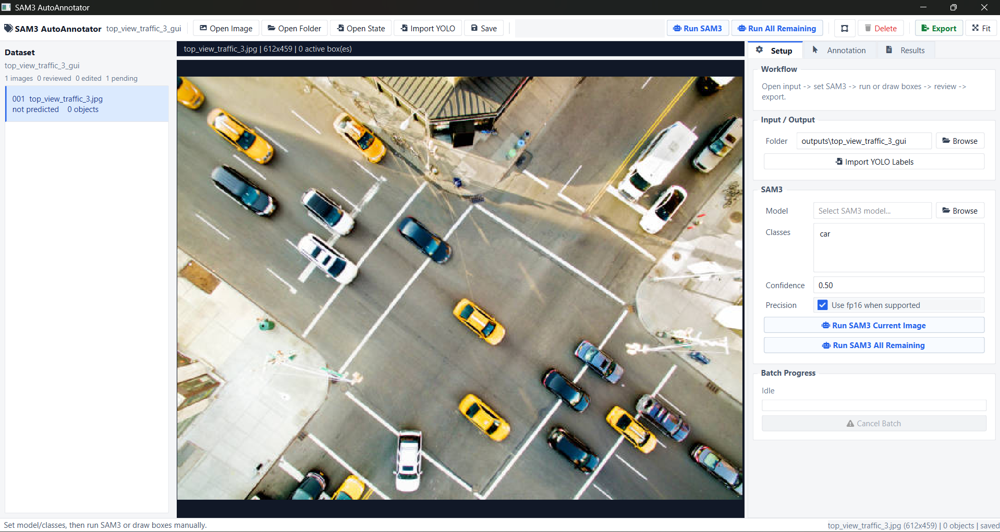

# SAM3 AutoAnnotator

SAM3 AutoAnnotator is a standalone PySide6 desktop application for creating and
reviewing object annotations with optional SAM3 assistance. It treats model
predictions as editable drafts: you can correct bounding boxes and classes,
import existing YOLO detection labels, regenerate segmentation from a corrected
box, save the project, and export reviewed data.

This repository is intentionally **GUI-only**. It is not a pip-distributed
package and it does not provide a command-line annotation workflow. `pip` is
used only to install the third-party dependencies listed in
`requirements.txt`.



## What it does

- Opens one image or every supported image directly inside one folder.
- Runs Ultralytics SAM3 from one or more text prompts.
- Keeps inference off the GUI thread and supports a cancellable pending-image
  batch.
- Imports YOLO detection labels and turns them into editable boxes.
- Lets you draw, select, move, resize, reclassify, reset, or delete boxes.
- Tracks each image as not predicted, predicted, edited, reviewed, no detection,
  or error.
- Saves an atomic, resumable `annotation_state.json` project file.
- Exports bounding-box CSV plus YOLO detection and valid YOLO segmentation
  labels.
- Reports segmentation omitted because it is stale, missing, or invalid instead
  of silently exporting incorrect polygons.

## Requirements

- Windows 10/11 is the primary tested environment.
- Python compatible with the versions in `requirements.txt`.
- A local SAM3 `.pt` checkpoint for inference.
- A CUDA-capable GPU is strongly recommended for practical SAM3 inference.

Model checkpoints are local runtime assets and are intentionally ignored by
Git. Place a checkpoint in `models/`; the application prefers a filename that
starts with `sam3`, or uses the sole `.pt` file when there is only one.

## Install and launch

From the repository root in PowerShell:

```powershell
py -m venv .venv
.\.venv\Scripts\python.exe -m pip install --upgrade pip
.\.venv\Scripts\python.exe -m pip install -r requirements.txt
.\.venv\Scripts\python.exe main.py
```

If the existing `.venv` is already prepared, only the last command is needed.
Do not run `pip install -e .`: the project deliberately has no packaging or CLI
entry point.

## Recommended workflow

```text
Open -> Configure -> Predict or Import -> Review/Edit -> Save -> Export
```

1. Use **Open Image** or **Open Folder**. Folder discovery is non-recursive.
2. In **Setup**, select the output folder and local model, enter one class prompt
   per line (or comma-separated), then set confidence and precision.
3. Use **Run SAM3** for the selected image, **Run Pending (N)** for untouched or
   failed images, or **Import YOLO** for existing detection labels. The count is
   derived from project state, and the action is disabled when it reaches zero.
4. Review every draft on the canvas. Draw or correct boxes and class names as
   needed. Editing a box or class invalidates its old segmentation.
5. Use **Re-segment** when a corrected box needs a fresh SAM3 polygon,
   then mark the image reviewed.
6. Use **Save Project** to persist the editable source of truth.
7. Use **Export Labels** to generate final files from the current project state.

The batch command deliberately skips predicted, edited, reviewed, and
no-detection images. Cancellation takes effect after the image currently being
processed; completed results remain available to save.

## Interface at a glance

The command bar is reserved for project-level commands: open and save. Work
that depends on the current context stays beside that context:

- **Setup** owns model, class, precision, import, and prediction controls.
- **Review** owns the current-image action, selected-annotation editor, and
  annotation table.
- **Export** owns export status, paths, preview, and export controls.
- The canvas bar owns overlay visibility, box drawing, and fit-to-window.

Setup and Export keep their action footers pinned while only their content
scrolls. Long project names, paths, image names, and task messages elide within
the widget that owns them and expose their full value in a tooltip; they do not
resize neighboring splitter panels. Each surface has at most one emphasized
primary action.

The supported layout acceptance sizes are **960 x 620** (minimum) and
**1360 x 840** (reference working size). See [UI audit](docs/ui-audit.md) for the
state, layout, and visual-language contract.

For detailed controls, shortcuts, status behavior, import rules, and recovery
guidance, see [User guide](docs/user-guide.md).

## Output

A project normally writes to `outputs/<project_name>/`:

```text
outputs/<project_name>/
|-- annotation_state.json
|-- sam3_auto_annotation_box_outputs.csv
|-- yolo_labels/
|   |-- detection/
|   |   `-- <image_stem>.txt
|   `-- segmentation/
|       `-- <image_stem>.txt
|-- preview_results/
|   `-- <image_stem>_reviewed.png
|-- segmentation_skipped_report.json   # only when required
`-- run_summary.json
```

`annotation_state.json` is the resumable editable project; exported CSV and
YOLO files are derived artifacts. Detection labels always use the current
bounding boxes. Segmentation labels contain only annotations whose polygon is
currently valid (`polygon_xyn` in normalized image coordinates). The application
creates an empty YOLO label file for an image that has no exportable annotation.

Source images are not copied, and export does not create `data.yaml` or dataset
train/validation/test splits.

## Project structure

```text
SAM3-AutoAnnotator/
|-- main.py                         # conventional desktop entry point
|-- requirements.txt               # third-party runtime dependencies
|-- sam3_auto_annotator/
|   |-- application.py             # QApplication composition root
|   |-- app_paths.py               # application-owned filesystem locations
|   |-- logging_setup.py            # diagnostics
|   |-- core/                       # pure project and annotation rules
|   |-- services/                   # project, prediction, edit, export workflows
|   |-- sam3/                       # Ultralytics adapter and result mapping
|   |-- storage/                    # image, JSON, CSV, and YOLO persistence
|   `-- gui/                        # PySide6 actions, views, models, tasks, widgets
|-- tests/
|-- docs/
|-- images_test/                    # small end-to-end verification fixtures
|-- models/                         # local checkpoints; ignored by Git
`-- outputs/                        # generated projects; ignored by Git
```

See [Architecture and design](docs/architecture.md) for dependency boundaries,
Qt component choices, layout rules, icon behavior, threading, and the rationale
for custom code.

## Known limitation

Polygon points cannot be edited directly. To correct segmentation, adjust the
bounding box and use **Re-segment**. Manual and imported boxes remain
detection-only until re-segmented.

## Verification

Repeatable unit and offscreen GUI commands, plus the pending real-model GPU
procedure, are documented in [Verification](docs/verification.md).

The latest handoff did **not** run real GPU inference because the development
laptop was operating on battery power. The documentation does not claim that
this pending hardware-dependent check passed.

## Design references

The implementation follows the mechanisms documented by the upstream projects:

- [Qt for Python: QMainWindow](https://doc.qt.io/qtforpython-6/PySide6/QtWidgets/QMainWindow.html)
- [Qt for Python: QToolBar](https://doc.qt.io/qtforpython-6/PySide6/QtWidgets/QToolBar.html)
- [Qt for Python: QAction](https://doc.qt.io/qtforpython-6/PySide6/QtGui/QAction.html)
- [Qt for Python: QSplitter](https://doc.qt.io/qtforpython-6/PySide6/QtWidgets/QSplitter.html)
- [Qt for Python: Model/View Programming](https://doc.qt.io/qtforpython-6/overviews/qtwidgets-model-view-programming.html)
- [Qt for Python: QThread](https://doc.qt.io/qtforpython-6/PySide6/QtCore/QThread.html)
- [Qt for Python: QSettings](https://doc.qt.io/qtforpython-6/PySide6/QtCore/QSettings.html)
- [Ultralytics SAM 3](https://docs.ultralytics.com/models/sam-3)
