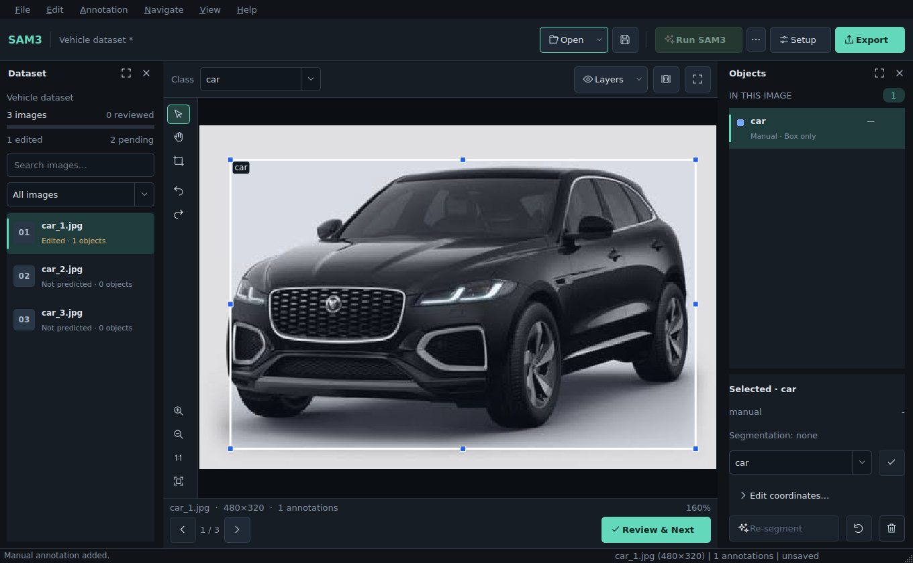

# SAM3 AutoAnnotator

SAM3 AutoAnnotator is a standalone PySide6 desktop workstation for creating and
reviewing object annotations with optional SAM3 assistance. Model predictions are
editable drafts: correct boxes/classes, import YOLO detections, re-segment corrected
boxes, save resumable project state, and export reviewed data.

This repository is intentionally **GUI-only**. It does not provide a command-line
annotation workflow.



This is **workspace v3**, branched from `redesign/canvas-workspace-v2`.
See the [visual walkthrough](docs/v3-review.md) for the compact layout, dialogs,
interaction fixes, and verification evidence.

## What it does

- Opens one image or every supported image directly inside one folder.
- Runs Ultralytics SAM3 from one or more text prompts.
- Keeps inference off the GUI thread and supports cancellable pending-image batch.
- Imports YOLO detection labels as editable boxes.
- Draws, selects, moves, resizes, reclassifies, resets, deletes, and undo/redoes
  annotation edits.
- Tracks image state: not predicted, predicted, edited, reviewed, no detection, or
  error.
- Saves atomic resumable `annotation_state.json` project state.
- Exports bounding-box CSV plus YOLO detection and valid YOLO segmentation labels.
- Reports stale/missing/invalid segmentation instead of silently exporting it.

## Requirements

- Windows 10/11 is the primary target environment.
- Python compatible with `requirements.txt`.
- A local SAM3 `.pt` checkpoint for inference.
- A CUDA-capable GPU is strongly recommended for practical SAM3 inference.

Use **Setup -> Annotation -> Model -> Browse** to choose a checkpoint. Automatic model discovery
looks in the application's user-data `models` directory, not in the repository.
On Windows the default application home is
`%LOCALAPPDATA%\SAM3-AutoAnnotator`; set `SAM3_AUTOANNOTATOR_HOME` to override it.

## Install and launch

From the repository root in PowerShell:

```powershell
py -m venv .venv
.\.venv\Scripts\python.exe -m pip install --upgrade pip
.\.venv\Scripts\python.exe -m pip install -r requirements.txt
.\.venv\Scripts\python.exe src/main.py
```

If `.venv` is already prepared, only the final command is needed.

## Recommended workflow

```text
Open -> Configure -> Predict/Import -> Inspect/Edit -> Review & Next -> Save -> Export
```

1. Use **Open Image** or **Open Folder**. Folder discovery is non-recursive.
2. Open **Setup** to choose output folder/model, configure class prompts,
   confidence, and precision. Setup is staged: **Apply** commits; Cancel/X discards
   the draft.
3. Use **Run SAM3** directly, or the adjacent **…** menu for **Run Pending (N)**
   and **Import YOLO**.
4. Work primarily on the canvas. Choose **Select**, **Pan**, or **Box** and keep the
   active next-box class visible beside the canvas tools.
5. Correct boxes/classes. Use **Re-segment** when changed geometry needs a fresh
   SAM3 polygon. Undo/Redo is available for completed object edits.
6. Use **Review & Next** to mark the current image reviewed and advance.
7. Use **Save Project** to persist the editable source of truth.
8. Press **Ctrl+E / Export** to open preflight. Opening preflight writes nothing;
   explicitly choose **Export Now** or **Export Anyway** to write final files.

Pending batch prediction skips predicted, edited, reviewed, and no-detection images.
Cancellation stops after the image currently processing; completed results remain
available to save.

## Interface at a glance

The workstation is canvas-first:

```text
QMainWindow
|-- project command bar: Open, Save, Run SAM3, Setup, Export
|-- left dock: Dataset
|-- center: image canvas and editing tools
|-- right dock: Objects / selected-object controls
|-- transient Setup dialog
|-- transient Export dialog
`-- status bar
```

- **Dataset** and **Objects** are independent `QDockWidget`s. Close, move, float, or
  restore them from **View**.
- **Focus Workspace** hides side docks without changing project state.
- **F11** controls application fullscreen. **Fit** only changes image framing.
- Canvas tools are explicit: **Select (Esc)**, **Pan (P)**, **Box (B)**.
- Hold **Space** over the canvas for temporary pan from Select or Box.
- **Layers** controls box, mask, and polygon visibility.
- Exact coordinates open in **Edit coordinates…**, with Apply/Cancel.
- **View → Reset Workspace Layout** restores both docks; **F1** shows shortcuts.
- Zoom Out, **100%**, Zoom In, and Fit are separate canvas commands.
- The active class for the next new box is independent from the selected object's
  class editor.
- Visible objects carry class/confidence labels on the canvas.
- Single-object Delete is immediate because Undo is the recovery path; destructive
  project-level replacement may still request confirmation.

The minimum supported window is **960 x 620**; **1360 x 840** is the reference
working size. The outcome-based UI contract lives in [UI audit](docs/ui-audit.md).
For detailed controls, shortcuts, recovery behavior, and import rules, see
[User guide](docs/user-guide.md).

## Application data and output

The repository is source code only. Runtime assets and generated projects are not
created under the repository root.

Default application home:

```text
Windows: %LOCALAPPDATA%\SAM3-AutoAnnotator\
macOS:   ~/Library/Application Support/SAM3-AutoAnnotator/
Linux:   $XDG_DATA_HOME/sam3-autoannotator/
         or ~/.local/share/sam3-autoannotator/
```

`SAM3_AUTOANNOTATOR_HOME` overrides that location on every platform. The default
subdirectories are:

```text
<app-home>/
|-- models/                  # optional automatic checkpoint discovery
`-- projects/
    `-- <project_name>/      # default output when Setup does not override it
```

A project output contains:

```text
<project_name>/
|-- annotation_state.json
|-- sam3_auto_annotation_box_outputs.csv
|-- yolo_labels/
|   |-- detection/
|   |   `-- <image_stem>.txt
|   `-- segmentation/
|       `-- <image_stem>.txt
|-- preview_results/
|   `-- <image_stem>_reviewed.png
|-- segmentation_skipped_report.json   # only when required
`-- run_summary.json
```

`annotation_state.json` is the resumable editable project; CSV/YOLO exports are
derived artifacts. Detection labels use current boxes. Segmentation labels contain
only annotations whose normalized `polygon_xyn` is currently valid. Empty images
receive an empty YOLO detection label file.

Source images are not copied. Export does not create `data.yaml` or dataset
train/validation/test splits.

## Project structure

```text
SAM3-AutoAnnotator/
|-- src/
|   |-- main.py                     # executable composition root
|   |-- app_paths.py                # OS user-data locations
|   |-- logging_setup.py
|   |-- version.py
|   |-- domain/                     # project/annotation rules
|   |-- services/                   # project, prediction, edit, export use cases
|   |-- sam3/                       # Ultralytics adapter/result mapping
|   |-- storage/                    # image/JSON/CSV/YOLO persistence
|   `-- gui/                        # PySide6 workstation
|-- tests/
|   `-- fixtures/images/            # small integration fixtures
|-- docs/
|-- requirements.txt
`-- .gitignore
```

`src/main.py` is the only executable entrypoint. There is no project-name wrapper
package and no root forwarding script.

## Known limitation

Polygon points cannot be edited directly. To correct segmentation, adjust the
bounding box and use **Re-segment**. Manual/imported boxes remain detection-only
until re-segmented.

## Verification scope

GitHub Actions resolves production dependencies and runs the full GUI/domain suite
on Linux and Windows. A second Windows pass uses the native Qt platform for pointer
and keyboard interactions. Both runners render the actual app at 100% and 150%
Qt scaling and upload the captures. See [verification](docs/verification.md).
Real SAM3/CUDA inference and the user's physical monitor/GPU remain outside these
checks; the screenshots use a manually drawn annotation on a repository fixture.

## Design references

- [Qt for Python: QMainWindow](https://doc.qt.io/qtforpython-6/PySide6/QtWidgets/QMainWindow.html)
- [Qt for Python: QDockWidget](https://doc.qt.io/qtforpython-6/PySide6/QtWidgets/QDockWidget.html)
- [Qt for Python: QGraphicsView](https://doc.qt.io/qtforpython-6/PySide6/QtWidgets/QGraphicsView.html)
- [Qt for Python: QUndoStack](https://doc.qt.io/qtforpython-6/PySide6/QtGui/QUndoStack.html)
- [Qt for Python: QDialog](https://doc.qt.io/qtforpython-6/PySide6/QtWidgets/QDialog.html)
- [Qt for Python: Model/View Programming](https://doc.qt.io/qtforpython-6/overviews/qtwidgets-model-view-programming.html)
- [Qt for Python: QThread](https://doc.qt.io/qtforpython-6/PySide6/QtCore/QThread.html)
- [Qt for Python: QSettings](https://doc.qt.io/qtforpython-6/PySide6/QtCore/QSettings.html)
- [Ultralytics SAM 3](https://docs.ultralytics.com/models/sam-3)
