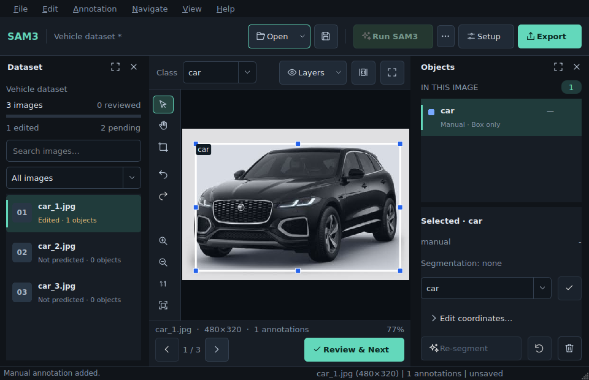
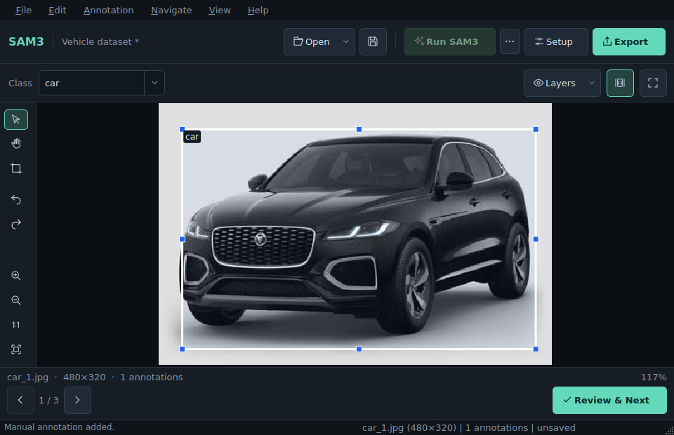
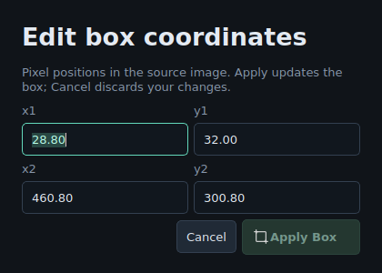
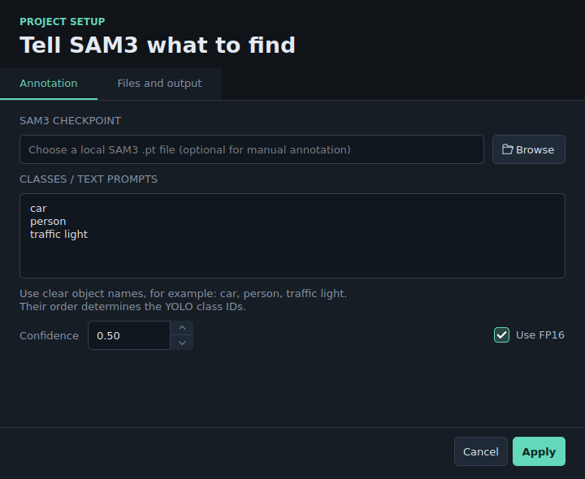
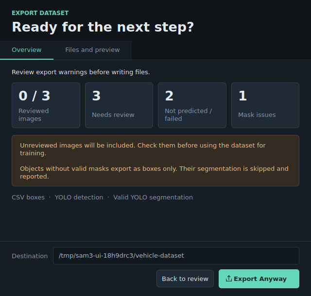
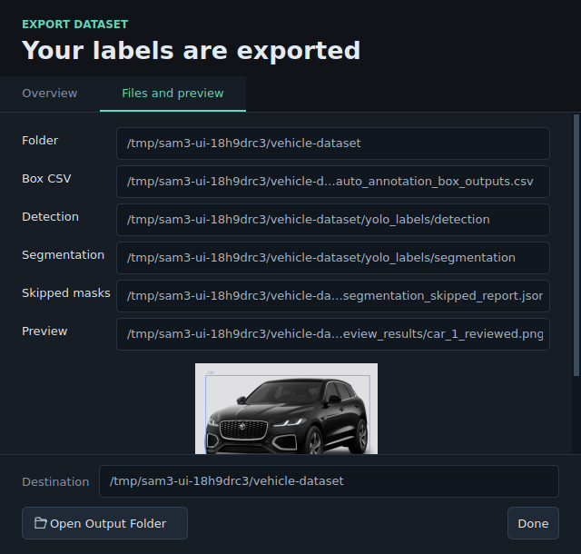
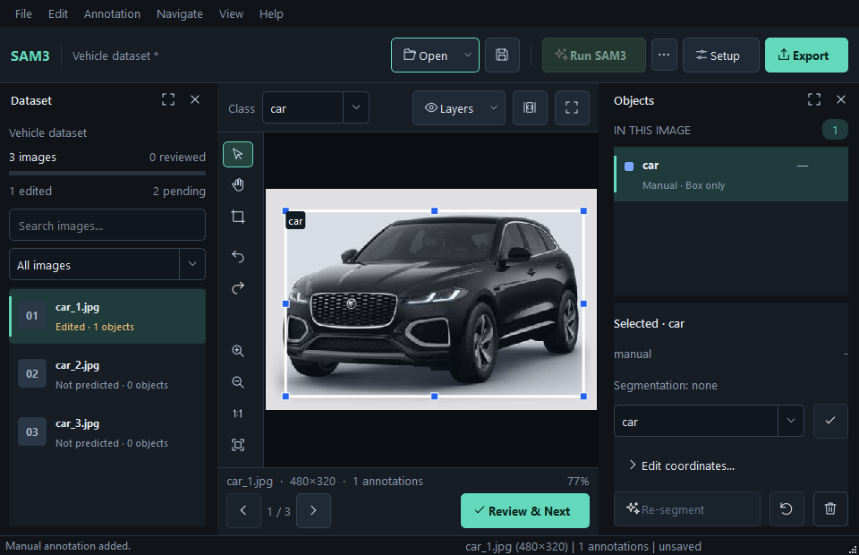
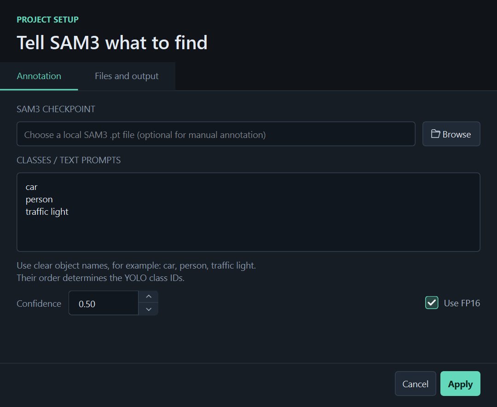

# Workstation visual review

This walkthrough describes the workstation currently shipped from `main`. It is a
visual/user-interaction reference, not a record of historical development branches.

## The workstation

The UI uses charcoal surfaces, mint primary actions, consistent SVG icons, and
separate areas for project commands, canvas editing, and image review. Dataset and
Objects use readable cards with status information. These are captures of the
running PySide6 application, using a manually drawn box on `car_1.jpg` from the
repository fixtures. No model predictions are fabricated.


The top bar keeps Open, Save, Run SAM3, Setup, and Export visible. Pending batch
and YOLO import are in the adjacent assistance menu. The canvas rail contains
editing/history/zoom; Previous, Next, and Review & Next are below the image.



At the current minimum 960 × 620 logical window, project commands remain visible
without an overflow menu. Focus Workspace hides both docks and restores their
visibility when switched off. It keeps the selected image and objects.



## Object editing

Pan moves the view even when the pointer starts over an annotation. It does not move
the annotation. Space temporarily pans from Select or Box and restores the tool on
release or focus loss. Esc cancels an unfinished box. Wheel and button zoom stop at
5% and 2000%, with the live percentage shown under the canvas.

Selecting an object reveals its class, source, confidence, and segmentation state.
Exact coordinates open in a separate dialog. Apply Box / Ctrl+Return commits;
Cancel restores the draft values. Invalid coordinates remain available to correct.
Completed edits preserve Undo/Redo and saved-state behavior.



Re-segment is a positional selected-object operation. It uses the visual SAM box
prompt path rather than treating the selected box as a semantic concept exemplar,
and result selection is constrained spatially to the requested box.

## Setup and export

Setup separates annotation settings from source/output paths. It has readable
prompts, a complete confidence field with clickable arrows, and staged Apply/Cancel.



Export shows review/mask readiness before writing. Its destination and confirmation
stay visible even when the dialog is short. Export Anyway acknowledges the stated
warnings. Managed output is staged and then published with rollback protection, so
an interrupted publish does not intentionally leave a mixed old/new label tree.
After writing, the dialog shows completion, generated paths, and preview; the export
button is removed so it cannot accidentally repeat the write.





## Verification and remaining hardware scope

The workflow checks draw → edit → undo/redo → save → reload → export, import and
export integrity boundaries, actual pointer targets, popup menus, coordinate
keyboard Apply, focus/dock restoration, and fullscreen round trips. Linux and
Windows run the full suite; Windows also runs the interaction suite with its native
Qt platform. CI uploads screenshots at 100% and 150% Qt scaling. See
[verification](verification.md) for current evidence.

The screenshot renderer explicitly sizes windows in logical pixels. Its
`measurements.json` records actual widget/pixel sizes, Qt platform, scale, and
available desktop. This verifies rendering, not whether a small CI desktop can
physically fit every requested window. Real SAM3/CUDA inference and physical monitor
behavior still require the intended workstation.

## Native Windows captures

The committed Windows captures show the minimum workstation and Setup at 150% Qt
scaling. Current CI also produces a complete native Windows capture artifact for
each run.





## Reproduce the captures

With project dependencies installed, from the repository root:

```powershell
$env:QT_QPA_PLATFORM = "windows"
python tools/render_ui.py --output-dir ui-captures
$env:QT_SCALE_FACTOR = "1.5"
python tools/render_ui.py --output-dir ui-captures-150
Remove-Item Env:QT_SCALE_FACTOR
```

The tool writes its demonstration project into a temporary directory and captures
actual widgets. Linux headless execution defaults to Qt offscreen. Screenshots
without the `windows-` prefix use the local Linux Qt renderer; Windows CI produces
the native capture set.
